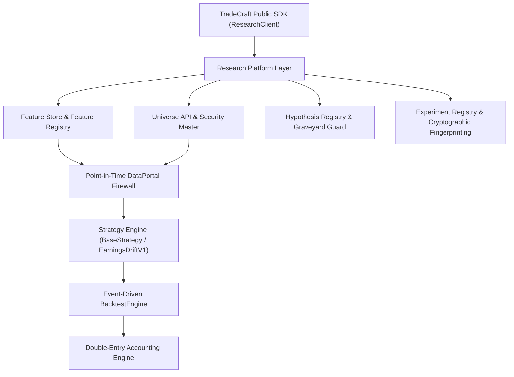

# COMPLETE TECHNICAL ARCHITECTURE GUIDE

## Subsystem Architectural Descriptions

1. **TradeCraft Public SDK (`src/tradecraft/sdk/research_client.py`)**:
   Single public entry point (`ResearchClient`) exposing research, universe, and experiment management capabilities to external scripts, notebooks, and dashboards.

2. **Point-in-Time Universe Architecture (`src/tradecraft/universe/`)**:
   - `DataProvider`: Vendor abstraction layer decoupling platform logic from Zerodha/NSE/Polygon.
   - `SecurityMaster`: Immutable UUID mapping (`security_uuid`) for ticker changes and ISIN history.
   - `UniverseRegistry` & `HistoricalMembershipEngine`: Point-in-time constituent membership tracking.
   - `CorporateActionRegistry`: Split, bonus, and dividend adjustment factor management.
   - `SurvivorshipGuard` & `UniverseAPI`: Ensures zero survivorship bias.

3. **Quantitative Feature Store & Feature Registry (`src/tradecraft/research/feature_store.py`)**:
   Implements 12 core technical and fundamental features with SHA256 checksums and `FeatureLineage` tracking.

4. **Experiment & Hypothesis Registries (`src/tradecraft/research/`)**:
   - `HypothesisRegistry`: Pre-registers immutable hypothesis records before writing code.
   - `ExperimentRegistry`: Cryptographically hashes full environment metadata (`pip freeze`, Python version, CPU, OS, RAM) into `execution_hash`.

5. **Strategy & Backtesting Layer (`src/tradecraft/strategy/` & `src/tradecraft/backtesting/`)**:
   - `BaseStrategy` & `SignalIntent`: Decouples signal generation from execution fills.
   - `DataPortal`: Point-in-time data portal enforcing clock date boundary checks.
   - `BacktestEngine`: Event-driven backtester supporting `FORCE_CLOSE` policy.
   - Double-entry accounting engine enforcing $₹0.0000$ residual cash reconciliation.
