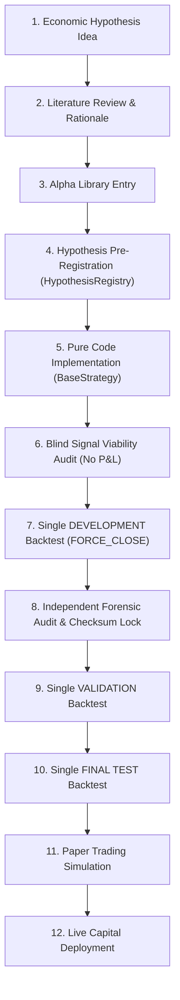

# QUANTITATIVE RESEARCH PLAYBOOK (END-TO-END WORKFLOW)

## Step-by-Step Execution Phase

1. **Idea & Literature Review**: Formulate economic & behavioral rationale supported by academic papers.
2. **Alpha Library Entry**: Verify alpha source metadata in `AlphaLibrary`.
3. **Hypothesis Pre-Registration**: Run `ResearchClient.validate_hypothesis_admission()` and `ResearchClient.register_hypothesis()`.
4. **Pure Code Implementation**: Implement strategy class inheriting from `BaseStrategy`.
5. **Blind Signal Viability Audit**: Run blind signal extraction to evaluate signal density, sanity checks, and timestamp gating without calculating P&L.
6. **Single DEVELOPMENT Backtest**: Run authoritative backtest under `FORCE_CLOSE` policy and evaluate pre-declared Survivor Gate.
7. **Independent Forensic Audit**: Recompute metrics, execute Monte Carlo bootstrap resampling, verify pre-registered criteria, and lock SHA-256 trade ledger checksum.
8. **Validation & Final Test**: Execute single validation run on sealed datasets upon user authorization.
