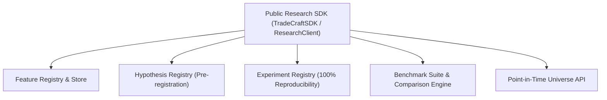

# QUANTITATIVE RESEARCH PLATFORM — START HERE

> **MANDATORY PLATFORM DIRECTIVE**:  
> All future notebooks, automation scripts, and quantitative researchers MUST consume platform features, pre-register hypotheses, and run experiments strictly through the public [TradeCraft Research SDK](file:///c:/infiligence/automated-trader-tool/src/tradecraft/sdk/research_client.py). Internal engines MUST NOT be accessed directly.

---

## 1. PLATFORM ARCHITECTURE MAP

---

## 2. DOCUMENTATION DIRECTORY

| Document | Purpose |
| :--- | :--- |
| [feature_registry.md](file:///c:/infiligence/automated-trader-tool/docs/research/platform/feature_registry.md) | Immutable feature definitions & lineage rules. |
| [feature_graph.md](file:///c:/infiligence/automated-trader-tool/docs/research/platform/feature_graph.md) | Visual feature dependency derivation graph. |
| [hypothesis_registry.md](file:///c:/infiligence/automated-trader-tool/docs/research/platform/hypothesis_registry.md) | Pre-registration workflow & hypothesis states. |
| [experiment_registry.md](file:///c:/infiligence/automated-trader-tool/docs/research/platform/experiment_registry.md) | Cryptographic experiment reproducibility. |
| [benchmark_framework.md](file:///c:/infiligence/automated-trader-tool/docs/research/platform/benchmark_framework.md) | Standardized quantitative baselines. |
| [readiness_checklist.md](file:///c:/infiligence/automated-trader-tool/docs/research/platform/readiness_checklist.md) | Pre-flight research readiness checklist. |
