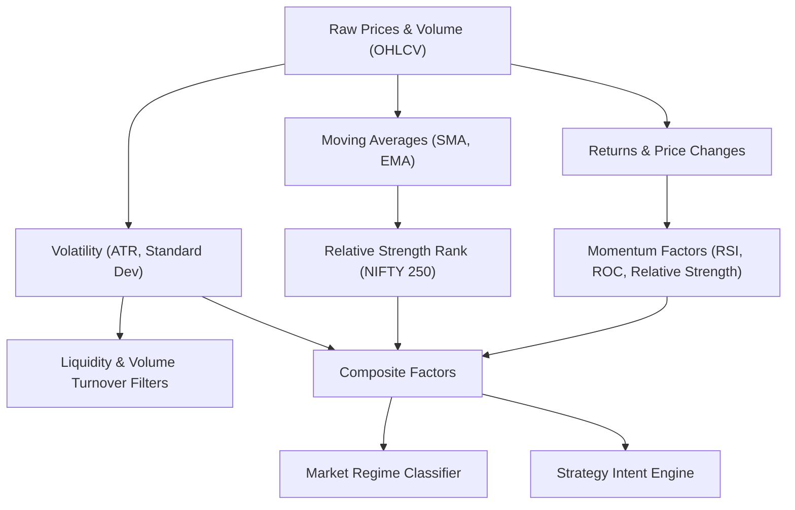

# FEATURE DEPENDENCY DERIVATION GRAPH

## Lineage Record Schema
Every feature calculation tracks:
$$\text{Feature UUID} \longrightarrow (\text{Depends On}, \text{Raw Features}, \text{Dataset Version}, \text{Corporate Action Version}, \text{Membership Version})$$
