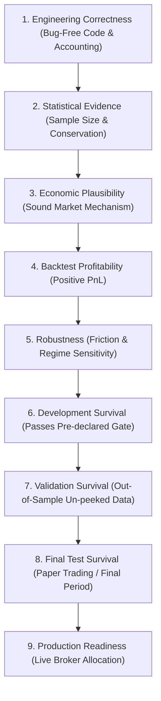
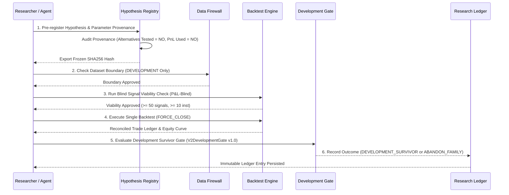

# TRADECRAFT RESEARCH METHODOLOGY & EXPERIMENT LIFECYCLE

> **METHODOLOGICAL SPECIFICATION**: Conceptual taxonomy and research lifecycle standards for TradeCraft.

---

## 1. CONCEPTUAL TAXONOMY — DO NOT CONFLATE

TradeCraft strictly distinguishes between nine distinct levels of research validity. Conflating these concepts is prohibited.

### Key Methodological Rules:
1. **Backtest Profitability $\neq$ Development Survival**: A strategy with +20.46% return (Mean Reversion V3) is NOT a Development Survivor if it fails any pre-declared gate criterion (Win Rate 14.2% < 35.0%).
2. **Development Survival $\neq$ Out-of-Sample Edge**: Passing the Development Gate means ONLY that a strategy is `ELIGIBLE_FOR_FUTURE_VALIDATION`. It does not guarantee out-of-sample edge.
3. **Engineering Defect $\neq$ Strategy Failure**: An accounting residual or sizing defect invalidates the backtest run; it does not prove or disprove strategy edge.

---

## 2. RESEARCH EXPERIMENT LIFECYCLE

