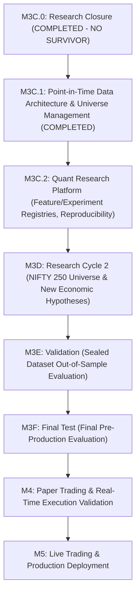

# TRADECRAFT MULTI-CYCLE RESEARCH ROADMAP

> **LONG-TERM RESEARCH ARCHITECTURE**: Strategic roadmap guiding future research cycles from data foundations to production deployment.

---

---

## MILESTONE BREAKDOWN & OBJECTIVES

### M3C.0 — RESEARCH CYCLE 1 CLOSURE (COMPLETED)
- **Status**: **`CLOSED_NO_SURVIVOR`**
- **Outcome**: Formally closed Research Cycle 1, locked all 4 strategy families in Research Graveyard, created permanent knowledge base (`docs/research/`) and machine-readable governance state.

---

### M3C.1 — POINT-IN-TIME DATA ARCHITECTURE & UNIVERSE MANAGEMENT (COMPLETED)
- **Status**: **`COMPLETED`**
- **Outcome**: Established Data Vendor Abstraction (`DataProvider`), Security Master (`security_uuid`), Universe Registry (`NIFTY50` to `NIFTY500`), Historical Membership Engine, Corporate Action Registry, Data Quality Auditor, Metadata Catalog, Survivorship Guard, and `UniverseAPI`.

---

### M3C.2 — QUANT RESEARCH PLATFORM (NEXT)
- **Status**: `PLANNED`
- **Scope**: Transform TradeCraft into an institutional-grade Quantitative Research Platform prior to starting Research Cycle 2:
  - **Feature Registry**: Versioned, reusable feature definitions with point-in-time calculation constraints.
  - **Experiment Registry**: Cryptographic tracking of every hypothesis run and parameter configuration.
  - **Dataset Versioning Engine**: Cryptographic dataset snapshot hashes (`dataset_version`).
  - **Benchmark Suite**: Standardized market regime and risk benchmarks.
  - **Hypothesis Registry & Pre-registration**: Immutable hypothesis lock prior to execution.
  - **Reproducibility Engine**: 100% deterministic backtest reproduction from experiment metadata.
  - **Experiment Comparison Matrix**: Multi-run quantitative comparison tooling.

---

### M3D — RESEARCH CYCLE 2 (NIFTY 250 UNIVERSE)
- **Status**: `PLANNED`
- **Scope**: Formulate and pre-register 2–3 genuinely new economic hypotheses operating on point-in-time NIFTY 250 universe on Development dataset (`2016-08-01` $\rightarrow$ `2021-12-31`).

---

### M3E — VALIDATION (SEALED DATASET EVALUATION)
- **Status**: `PLANNED` (Sealed)
- **Scope**: Single out-of-sample evaluation of M3D survivors on Validation dataset (`2022-01-01` $\rightarrow$ `2024-06-30`).

---

### M3F — FINAL TEST
- **Status**: `PLANNED` (Sealed)
- **Scope**: Final pre-production evaluation on Final Test dataset (`2024-07-01` $\rightarrow$ `2026-07-28`).

---

### M4 — PAPER TRADING
- **Status**: `PLANNED`
- **Scope**: Real-time Kite Connect paper trading execution.

---

### M5 — LIVE TRADING
- **Status**: `PLANNED`
- **Scope**: Production live broker capital allocation.
