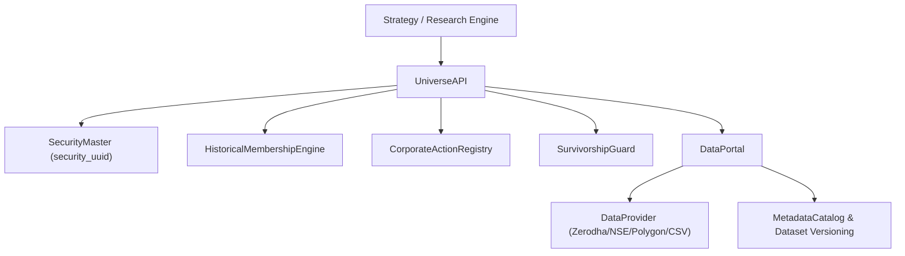

# POINT-IN-TIME DATA ARCHITECTURE OVERVIEW

The Point-in-Time Data Architecture ensures that at any historical date $T$, the research engine can reconstruct exactly which securities were listed, investable, and members of any specified universe (NIFTY 50, NIFTY 100, NIFTY 200, NIFTY 250, NIFTY 500), without relying on today's index membership.
